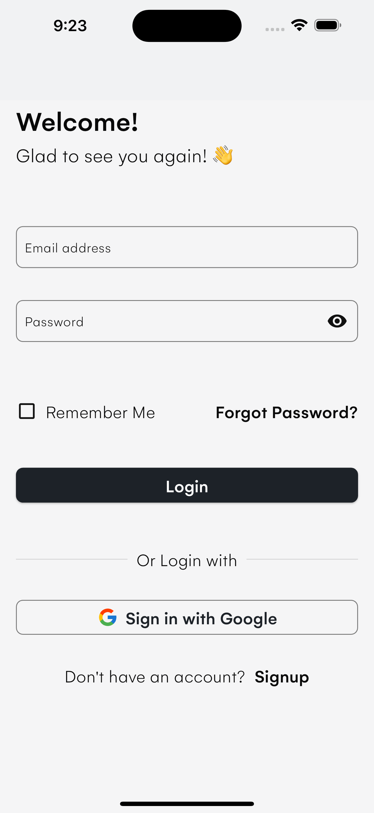

# Smart home control app developed with Flutter <a href="https://flutter.dev" target="_blank" rel="noreferrer"> </a>

This app was developed to remotely control a smart home system from anywhere in the world, provided that the device is connected to the internet. 
The app was developed with Flutter and Firebase.

## 📸 Screenshots

| 1                                         | 2                                         | 3                                         |
|-------------------------------------------|-------------------------------------------|-------------------------------------------|
|  |  |  |

| 4                                         | 5                                         | 6                                         |
|-------------------------------------------|-------------------------------------------|-------------------------------------------|
|  |  |  |


## Packages & Libraries Used

* [Flutter SVG](https://github.com/dnfield/flutter_svg) (SVG)
* [Flutter ScreenUtil](https://github.com/OpenFlutter/flutter_screenutil) (Responsive UI)
* [Riverpod](https://github.com/rrousselGit/river_pod) (State management)
* [Json Serialization](https://github.com/dart-lang/json_serializable) (Serialization)
* [Intl](https://github.com/dart-lang/intl) (Localization)
* [Firebase Core](https://github.com/firebase/flutterfire/tree/master/packages/) (Firebase services)
* [Firebase Auth](https://github.com/firebase/flutterfire/tree/master/packages/) (Authentication)
* [Firestore](https://github.com/firebase/flutterfire/tree/master/packages/) (Database)
* [Google Sign In](https://github.com/firebase/flutterfire/tree/master/packages/) (Google Authentication)


# smart_home

A FinalYear project for smart home developed with Flutter (and Arduino).

## Getting Started

This project is a starting point for a Flutter application.

A few resources to get you started if this is your first Flutter project:

- [Lab: Write your first Flutter app](https://docs.flutter.dev/get-started/codelab)
- [Cookbook: Useful Flutter samples](https://docs.flutter.dev/cookbook)

For help getting started with Flutter development, view the
[online documentation](https://docs.flutter.dev/), which offers tutorials,
samples, guidance on mobile development, and a full API reference.

## How to use

**Step 1**

Download or clone this repo by using the link below
```
https://github.com/enoch-aik/smart_home.git
```

**Step 2**

Go to project root and execute the following command in console to get the required dependencies:

```
flutter pub get
```

## Hide Generated Files

In-order to hide generated files, navigate to `Android Studio` -> `Preferences` -> `Editor` -> `File Types` and paste the below lines under `ignore files and folders` section:
